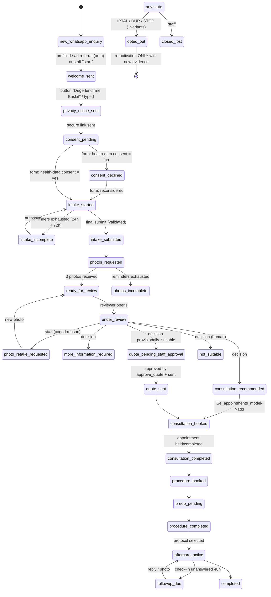

# WhatsApp → CRM eyebrow-transplant patient journey (`se_journey`)

Built 2026-09-02 on `main` `81d9118`, then rebased the same day onto `main` `3f0d799`
(the inbox media store, shared chat UI, voice/attachment composer and R2 attachment storage that
landed in parallel — see §0.1) for the Azin Asgari – Kaş Ekimi, İstanbul CRM
(Perfex 3.4.1, PHP 8.1.34, MariaDB 10.11, cPanel). Everything in this document was
exercised by the network-free suite (`php modules/se_core/tests/run.php` → **2,635 pass, 0 fail**,
every pre-existing suite included) and rendered for the 390 px / 768 px screenshots in
`docs/evidence/journey/`.
Nothing below claims a live Meta status the session could not observe; §11 marks those.

---

## 0. Baseline and audit summary (before any edit)

| Item | Finding |
|---|---|
| Branch / HEAD | `main` = `81d9118` ("feat(ops): Cloudflare cron Worker for the per-minute messaging dispatcher"), clean tree |
| Existing modules | `se_core` (brands, scoping, consent ledger, patients, outbox, health), `se_whatsapp` (signed webhook, event queue, conversations/messages, outbound queue with 24h-window rule, template mirror, live transport gated on `wa_token`), `se_instagram`, `se_appointments` (model with slot lock + overlap check, reminders, status history) |
| WhatsApp provider | **Meta WhatsApp Cloud API**, Graph `v23.0` default, number **+90 547 120 70 70** (WABA `1398503638806590`, phone-number id `1290456080816587`), **coexistence** with the WhatsApp Business app (handset echoes are ingested as `source=handset`). Webhook `https://crm.roozbeh.com.tr/se_whatsapp/webhook` verified by Meta and live-tested 2026-08-31 (inbound + outbound + delivery receipt). See §11 |
| Signature verification | `X-Hub-Signature-256` HMAC-SHA256 over the raw body with the Meta App Secret (`meta_app`, `wa_app` optional), constant-time — verified against official docs |
| Persistence | `tblse_wa_webhook_events` (dedup on body hash, claim/lease/fence), `tblse_wa_conversations` (per number+user, `window_expires_at`), `tblse_wa_messages` (dedup on `wamid`), `tblse_wa_outbound` (idempotency key, window re-check at send) |
| Reusable primitives | `tblleads` (+ attribution/consent columns), `tblse_consent_ledger` (append-only), `tblse_patients`, `tblse_record_access_log`, `tblse_procedure_history`, `tblse_appointments` + history + reminders, conversion outbox, file secret store `SE_SECRET_DIR`, `se_ui_*` helpers, brand-scoping helpers |
| Gaps found | no interactive (button) messages; no media download (at `81d9118` — the inbox media store arrived upstream the same day, see §0.1); conversation `lead_id` never set; a `failed` delivery status was recorded on the message row only (tracker stayed "sent", no error code); `se_consent` purposes lacked health-data and photo-publication; no journey/state concept; no Flows support anywhere |
| Test state | 1,798 pass at `81d9118` (fake-DB tier) — 32 depend on `application/vendor` (google/auth) |
| PHP compatibility | code written for 8.1 (no 8.2+ syntax); suite run on 8.4 with `E_ALL`, zero warnings |

### 0.1 Upstream reconciliation (`81d9118` → `3f0d799`, six commits of 2026-09-02)

While the journey was being built, `main` gained `se_core/se_media.php` (+`se_media_storage.php`,
`se_chat_ui.php`, `services/crm-media`): every inbound WhatsApp/Instagram attachment is now
registered in `tblse_media` and fetched **asynchronously** by the dispatcher step `media` (never
inside webhook/event processing), stored outside the docroot or in R2 (`azin-media`, via the
`crm-media` Worker), and shown inline in the thread. Schema went 13 → 16. The journey was rebased
on top and reconciled rather than duplicated:

| Journey piece at `81d9118` | After the rebase |
|---|---|
| own downloader `se_whatsapp/media.php` (`se_wa_fetch_media`, 5 MB, sha256) | **removed** — the inbox store's fetch is the single Graph media path |
| listener fetched the photo synchronously | listener **parks** a placeholder (`pending_fetch`, `inbox_media_id`) and a new dispatcher step **`journey_media`** (right after `media`; also the 15-min cron) seals the bytes from the inbox row (`se_media_local_copy`, R2-aware) into the journey store — the "never fetch inside an event" rule now holds for the journey too |
| `SE_MEDIA_DIR` constant for the journey store | renamed **`SE_JOURNEY_MEDIA_DIR`** — the inbox store owns `SE_MEDIA_DIR`; the journey store is separate and **lives in R2** (`azin-media`, keys `crm/journey/…`, sealed before upload) through the same `crm-media` gateway, with the local directory as a fallback only (§5) |
| schema v14 = journey | journey is **v17** (14–16 = inbox media); `se_wa_outbound` gained `media_id` upstream and `payload_json`/`origin` here |
| failed-status error shown in the WhatsApp view | moved into the shared thread renderer `se_ui_chat_thread` (`se_chat_ui.php`) so WhatsApp and Instagram threads both show it |
| `kind=media` outbound (upstream) | obeys the same 24-hour-window re-check as text/interactive; `se_journey_on_outbound_skipped` sees it |

**Owner decision, now a switch:** the inbox store keeps a plain (not sealed) copy of every
inbound attachment for the thread — including a patient's evaluation photos — readable by any staff
member who can open that WhatsApp conversation (`se_core/se_media/view` checks
`staff_can('view', se_whatsapp)` + brand scope), whereas the journey copy needs `view_photos`. That
is upstream's own 2026-09-02 design. Journeys → Settings → *"After sealing, remove the plain copy
from the WhatsApp thread store"* (`se_journey_purge_inbox_copy_<brand>`, default **off**) deletes
the thread copy once the sealed one exists (local unlink, or gateway `DELETE` — the route added to
`services/crm-media` in this branch; a Worker deployed without it answers 405, the copy is kept and a
task says so). The thread keeps a "photo received" placeholder.

## 1. What was built (extends, never duplicates)

```
modules/se_journey/            new module (loads after se_instagram, before se_whatsapp)
  helpers.php     schema v17, capabilities, state machine + immutable transition log,
                  identity/attribution, keywords, inbound listener, automation control
  messaging.php   copy registry (TR), central send policy, welcome/link/photo senders,
                  reminders, logical template registry + Meta submission (gated)
  intake.php      hashed tokens (TTL/rotation/revocation), libsodium encryption at rest,
                  questionnaire v1, validation, review flags, consent capture
  media.php       content validation, re-encode/strip, sealed private storage, WhatsApp
                  photo parking + sealing from the inbox media store (dispatcher step
                  journey_media), staff photo actions, signed expiring view URLs
  review.php      staff decision, quote draft → approval gate → immutable snapshot → send
  consultation.php booking through Se_appointments_model, status reflection, pre-op, procedure
  aftercare.php   configurable protocols, scheduled events, check-in replies, escalation
  health.php      readiness, health, dashboard counters
  controllers/Se_journey.php  staff screens (POST+CSRF+capability)   controllers/Intake.php  public token pages
  views/*.php, views/public/*.php, language/{english,turkish}
modules/se_whatsapp            + inbound listener seam, interactive kind, `origin`, deferred send,
                                 staff-takeover hook, failed-status capture (error code on the row)
modules/se_core                + consent purposes health_data/photo_publication, schema v17 hook,
                                 authz record types, nav item, clinic roles, health blockers, journey_key
                                 provider, dispatcher step `journey_media`, failed-status reason in `se_ui_chat_thread`
modules/se_core/tests          + fake-DB groups/or_where/IS NULL/NOT IN, journey fixtures, 3 suites, render harness
```

No second inbox, patient table or outbox exists. The WhatsApp thread, the lead, the patient
record, the consent ledger and the appointment calendar are the existing ones.

## 2. Architecture

```
Meta ──signed POST──► /se_whatsapp/webhook ──► tblse_wa_webhook_events (dedup, 200 fast)
                                                        │ per-minute dispatcher / 15-min cron
                                                        ▼
                                              se_wa_process_pending()
                                                        │ NEW inbound message only
                                                        ▼
                                     se_wa_notify_inbound_listeners(ctx)
                                                        ▼
                                          se_journey_on_wa_inbound(ctx)
   opt-out ▸ reactivation ▸ handoff ▸ urgent ▸ media ▸ aftercare reply ▸ pause check ▸ step routing
                                                        │
                                                        ▼
                                              se_journey_send(spec)          ◄── every automated message
   opt-out > pause > brand flag > sandbox allow-list > quiet hours > daily cap > window/APPROVED template
                                                        ▼
                                     se_wa_queue_message() → tblse_wa_outbound → drain → Cloud API
```

* Inbound reactions run inside the existing WhatsApp event drain, so welcome/acknowledgements
  leave within the dispatcher's minute. Scheduled work (reminders, aftercare, parked media,
  appointment sync, template status) runs on `after_cron_run` (15 min) via `se_journey_cron()`.
* A listener exception is contained (`se_wa_listener_last_error` = class name only); the
  webhook event is still marked processed because the message is already stored and a replay
  would be deduplicated on `wamid`.

### 2.1 State machine



Every transition writes `tblse_journey_transitions` (from, to, trigger, actor_type
patient|staff|system|provider, actor_id, correlation_id = wamid/appointment/plan, note,
timestamp). Illegal transitions are refused (`se_journey_transition_allowed`); a staff
`force` is possible only in code paths that audit it.

### 2.2 Identity and attribution

* WhatsApp id → E.164 digits (`0 5xx…` national form normalised). One journey per
  (brand, wa_user_id) — DB unique key.
* One CRM person: the lead is found by a normalised phone scan of the brand's leads
  (Perfex stores free text), else created (`+90…`, masked name until the form supplies one).
  `tblse_wa_conversations.lead_id` is now filled.
* Source detection (`se_journey_detect_source`): Meta `referral` object → `meta_click_to_whatsapp_ad`
  (attribution JSON keeps `source_type, source_id, source_url, headline, body, media_type,
  ctwa_clid, welcome_message`; `ctwa_clid` also lands on the lead and the conversation).
  Otherwise text match → `instagram_prefilled_link` with confidence `exact` (normalised
  equality) or `close` (≥ 0.85 similarity); `instagram_manual_handoff` for a paraphrase;
  `organic_whatsapp` for anything else. **No campaign/ad id is ever fabricated** (`utm_campaign`
  stays null on a text match; `utm_content = ad:<source_id>` only from a referral).
* Organic enquiries create the journey and a staff task; the bot starts only when staff press
  "Send welcome" (or the brand option `se_journey_auto_start_organic_<brand>` is on).

### 2.3 Data model (all `tblse_journey_*`, brand-scoped, additive, schema v17)

`se_journeys` · `se_journey_transitions` · `se_journey_events` (timeline, non-sensitive summaries)
· `se_journey_tokens` (SHA-256 only) · `se_journey_intakes` (`answers_enc` sealed) ·
`se_journey_media` (sealed files, `evaluation_use_permitted` ≠ `publication_permitted`) ·
`se_journey_reviews` · `se_journey_quotes` (+ `snapshot_json`/`snapshot_hash`) ·
`se_journey_aftercare_plans` / `_events` (`reply_enc` sealed) · `se_journey_templates` ·
`se_journey_tasks` · `se_journey_audit` · `se_journey_throttle`.
Existing tables gain nullable columns only: `se_wa_messages.interactive_id`, `.status_error`,
`se_wa_outbound.payload_json`, `.origin`. Nothing is renamed or dropped; `se_patients.retention_state`
untouched.

## 3. Conversation behaviour and copy

Turkish source copy lives in `se_journey_copy_defaults()`; per-brand overrides via the
versioned option `se_journey_copy_<brand>` (Settings → copy). Every send records the copy version.

| Step | Copy key | Notes |
|---|---|---|
| Welcome | `welcome` (+ buttons `btn_start`, `btn_handoff`, `btn_stop`) | Interactive reply buttons when the body ≤ 1024 chars (it is), text fallback when `se_journey_interactive_<brand>=0`. Identifies itself as automated. |
| Privacy + link | `privacy_and_link` | Sent on "Değerlendirme Başlat"; link TTL stated |
| Consent gate closed | `consent_gate_unavailable` | Sent when no approved health-data text exists; automation → `awaiting_approval` |
| Photos request | `photos_request` | Exact wording from the brief + secure upload link |
| Retake | `photo_retake` + `retake_<reason>` | reasons: blurry, dark, makeup, filter, angle, crop, other |
| Evaluation ready | `evaluation_ready` | Exact wording from the brief; preliminary, no guarantee |
| Handoff / urgent / opt-out acks | `handoff_ack`, `urgent_ack`, `optout_confirm` | Never diagnose; urgent points to 112 |
| Reminders | `intake_reminder_1/2`, `photos_reminder_1/2` | One after 24 h, one final after 72 h, then staff task and STOP |

**Adaptation (brief vs platform):** Meta caps reply-button titles at 20 characters; the brief's
`Değerlendirmeye Başla` is 21. The button is `Değerlendirme Başlat` (20); typed
`değerlendirmeye başla` is still accepted. The welcome text quotes the button label.

Keywords (normalised, Turkish-folded): opt-out `iptal, dur, stop, …`; handoff `danışman,
temsilci, insan, ara, …` + button `jr_handoff`; start `değerlendirme(ye) başla(t), başla, devam,
evet`; urgent (aftercare phases) `şiddetli ağrı, kanama, nefes, şişlik/görüş, ateş, iltihap,
alerji, 112, …`. Extra keywords via options `se_journey_{optout,handoff,urgent}_keywords`.

Staff takeover: any reply from the WhatsApp composer pauses automation on that thread
(`paused_staff`, audited); "Resume" is a deliberate, audited staff action. Handoff pauses as
`paused_patient` with an urgent task.

## 4. Consent and the secure form

* Purposes in the ledger: `health_data` (required for evaluation — health answers **and**
  photos), `photo_publication` (optional, never implied), `marketing` (optional, unticked),
  `whatsapp` (opt-out withdraws it). Each row keeps question key, raw answer, server-resolved
  text version, channel + IP/UA hash fragments.
* **Production gate:** the form refuses health sections until Consent Settings holds an
  enabled `health_data` text in TR **and** EN with a version (`se_consent_text_configured`).
  Until then the bot tells the patient the form is being prepared and staff get a task.
  Admin-only emergency bypass (`Settings → bypass`, reason required, audited) shows
  `[TASLAK — hukuk onayı bekliyor]` placeholder wording. **No final legal text is invented here.**
* Links: 32 random bytes → base64url in the message; only SHA-256 stored; purpose-bound
  (`intake|upload|quote|checkin|info`); default TTL 48 h (`se_journey_intake_ttl_hours`);
  re-sends rotate (old link keeps a 2 h grace); revocation supported; per-IP throttle
  (60 verifications / 10 min, 120 POSTs / 10 min, 40 uploads / 10 min). No patient data in URLs.
* Form: standalone mobile-first Turkish page, CI CSRF on every POST, security headers
  (`no-store`, `X-Frame-Options: DENY`, `nosniff`, `Referrer-Policy: no-referrer`, CSP with
  `default-src 'none'`, `X-Robots-Tag: noindex`), section autosave (JSON), explicit final
  submission with summary, server-side validation against the questionnaire definition,
  unknown fields dropped, option allow-lists, bounded lengths.
* Encryption: libsodium `secretbox` (XSalsa20-Poly1305), key = secret provider `journey_key`
  (32 bytes base64, `SE_SECRET_DIR/journey_key`, mode 0600), `key_version` recorded. With no
  key the form **refuses** to store health data (fail closed). Check-in replies use the same seal.
* Questionnaire v1 = the brief's three sections (identity/contact, concern/goals, health
  screening) with "Bilmiyorum" / "Klinisyenle görüşmeyi tercih ederim" where acceptable, age
  instead of DOB, masked non-editable WhatsApp number, the infectious-disease question only when
  `se_journey_ask_infectious_<brand>=1` (approved wording required).
* Review flags (attention only): `anticoagulant_reported, pregnancy_reported, active_skin_problem,
  allergy_reported, unstable_hair_loss, prior_transplant, keloid_tendency, immune_suppression,
  bleeding_disorder, prior_procedure_near_area, anesthesia_complication, alopecia_reported,
  age_under_18, missing_answer:<field>`. Nothing auto-decides.

## 5. Photographs

* Accepted from the secure upload page (kind chosen by the patient) and from WhatsApp inbound
  images (kind `unclassified` until staff classify). Both paths run `se_journey_media_ingest`,
  which re-checks ledger consent, validates by content (magic bytes → executable/archive
  rejection, `finfo` MIME allow-list jpeg/png/webp, extension agreement, `getimagesize`,
  300–8000 px), and re-encodes through GD (drops EXIF/metadata and neutralises appended
  payloads); without GD a polyglot is rejected.
* Storage: bytes are **sealed in PHP first** (libsodium secretbox, `journey_key`), then written
  by the driver `se_journey_media_storage_driver()` — option `se_journey_media_storage`
  `auto` (default: **Cloudflare R2** as soon as the `crm-media` gateway is ready, i.e. option
  `se_media_r2_url` + secret `r2_media_key`), `r2`, or `local`. R2 objects are
  `crm/journey/<brand>/<journey>/<random>.enc` in bucket `azin-media` (the CRM host holds no R2
  credential; the Worker holds the binding; a leaked signed URL yields ciphertext only, and the CRM
  never mints signed URLs for journey objects — staff views stream the decrypted bytes through the
  capability-gated route). When the gateway is unreachable at write time the photo is sealed into the
  local directory (`SE_JOURNEY_MEDIA_DIR` / option `se_journey_media_dir`, default
  `/home/hyundaic/_se_journey_media`, 0700) with a visible `media_store_fallback` event, and the
  15-minute cron (`media_to_r2`) uploads, reads back, compares and unlinks. Every row records its
  `storage`. Erasure goes through `se_journey_media_delete_object` (gateway `DELETE`, idempotent).
  Inbox attachments (voice, video, documents) are R2-backed by upstream's own driver when
  `se_media_storage=r2` — that is where the "video archive" lives; the journey stores photos only.
* Staff view: `se_journey/se_journey/media/<id>?e=<exp>&s=<hmac>` — capability `view_photos`,
  signature bound to media id + staff id + expiry (10 min), `no-store`, audited (`view_photo`).
* WhatsApp media download: the inbox media store (`se_core/se_media.php`) registers the
  attachment when the message is stored and the dispatcher step `media` fetches it with the Cloud
  API token (Graph `GET /{media-id}` → short-lived URL → authenticated GET, 25 MB cap, mime
  allow-list, image sniff, 5 attempts with backoff). The journey listener never downloads: it
  **parks** a placeholder (`pending_fetch`, `inbox_media_id`) and the next step, `journey_media`,
  seals the bytes from the inbox row into the journey store (validation + re-encode as above,
  5 MB journey cap), then sends the acknowledgement. Without `wa_token` the inbox row keeps
  retrying (`no wa_token`), the placeholder waits, task `media_fetch_gated` names the gate; when
  the inbox store gives up (`failed`) the placeholder becomes `fetch_failed` with the reason and
  task `media_fetch_failed` points staff to the secure upload link.
* Staff actions: classify, **Accept photos**, **Request retake** (kind + coded reason → concise
  instruction), **Request donor photo** (donor becomes required), **Ready for review**.

## 6. Review, quote, consultation, procedure, aftercare

* Review tab: notes (never sent), checklist, assignee, due, decision
  (`more_information | consultation_required | provisionally_suitable | not_suitable |
  unable_to_assess`) → state transition + task. Nothing is computed from health answers.
* Quote: draft (currency, min/max, show-amount subject to clinic policy `hidden|range|exact`,
  validity, included/excluded, deposit terms, travel notes, internal notes + margin) →
  **request approval** → **approve** (capability `approve_quote`, checked in the model too) →
  **send**: patient-facing snapshot built from an allow-list (internal fields can never leak),
  `snapshot_hash`, quote token (14 days), message `evaluation_ready`, state `quote_sent`,
  pipeline milestone "Quote Sent" to the conversion outbox (consent-gated there). Editing after
  send creates a new version; the sent one is immutable.
* Consultation/procedure: booked through `Se_appointments_model->add` (advisory slot lock,
  overlap and working-hours check, status history, reminder queue, calendar sync). Status
  changes (held/completed/cancelled/no_show) made anywhere are reflected on the journey by
  `se_journey_sync_appointments()`. Deposit = state + reference (card-like digit runs redacted).
  Pre-op: checklist (logistics only) + information message **only** when
  `se_journey_preop_text_approved_<brand>=1` and a URL exists; otherwise a staff task.
  Procedure completion writes `tblse_procedure_history`; technical fields only when
  `se_journey_technical_fields_<brand>=1`.
* Aftercare: protocols are data (`se_journey_aftercare_protocols_<brand>` JSON, validated);
  the shipped `standard` protocol has the brief's intervals (first 24 h, day 1, 3, 7–10, 14,
  month 1, 3, 6, 12) and **no** instruction text and is `approved=0` — instruction steps on an
  unapproved protocol create staff tasks instead of sending. Check-ins/photo requests go through
  the central policy; unanswered 48 h → `followup_due` + task; replies are sealed and thanked
  once; urgent keywords escalate (pause, urgent task, notification to on-call/admins, 112 wording).

## 7. Roles and permissions

Feature `se_journey`: `view, view_health, view_photos, edit_review, approve_quote,
manage_consultation, manage_aftercare, export_health, manage_templates, manage_consent`.
Default deny (admins pass). Clinic roles seeded by `se_clinic`: **Clinic Owner** = everything
except templates; **Sales** = `view` + `manage_consultation`. Integration administration =
`se_staff_can_configure_brands()`. Brand scoping applies to every read (`se_journey_get`,
`se_journey_media_get`, lists). Audit (`tblse_journey_audit`): view_intake, view_photo,
view_checkin, export_intake, quote_*, photos_*, automation_pause/resume, consent_bypass_*,
settings_saved, template_*.

## 8. Configuration

Options (Journeys → Settings; presence only, no values shown anywhere):

| Option | Default | Meaning |
|---|---|---|
| `se_journey_enabled_<brand>` | 0 | master switch (listener does nothing when off) |
| `se_journey_sandbox_<brand>` | **1** | real sends only to `se_journey_test_recipients_<brand>`; everything else recorded as `sandbox_send` |
| `se_journey_interactive_<brand>` | 1 | reply buttons vs text fallback |
| `se_journey_auto_start_organic_<brand>` | 0 | bot on organic enquiries |
| `se_journey_intake_ttl_hours` | 48 | link TTL |
| `se_journey_reminder_hours` | `24,72` | reminder schedule |
| `se_journey_quiet_hours` | `21:00-09:00` | scheduled sends deferred (clinic tz) |
| `se_journey_daily_cap` | 3 | automated messages / journey / 24 h (replies exempt) |
| `se_journey_urgent_staff_ids` | — | on-call notification targets (admins otherwise) |
| `se_journey_public_base_url` | site_url | https base for patient links |
| `se_journey_quote_amount_policy_<brand>` | range | hidden / range / exact |
| `se_journey_preop_text_approved_<brand>`, `se_journey_preop_info_url_<brand>` | 0 / — | pre-op gate |
| `se_journey_technical_fields_<brand>`, `se_journey_ask_infectious_<brand>` | 0 | clinic choices |
| `se_journey_consent_bypass_<brand>` (+`_reason`) | 0 | admin emergency bypass |
| `se_journey_media_storage` | auto | sealed photo store: auto (R2 when ready) / r2 / local |
| `se_journey_purge_inbox_copy_<brand>` | 0 | drop the plain thread copy after sealing (needs the DELETE route for R2 copies) |
| `se_media_r2_url`, secret `r2_media_key`, `se_media_storage=r2` (upstream) | — | the crm-media gateway; shared by inbox attachments and sealed journey photos |
| `se_journey_media_dir` | `<home>/_se_journey_media` | local fallback store (or constant `SE_JOURNEY_MEDIA_DIR`) |
| `se_journey_key_version` | k1 | recorded on sealed rows |
| `se_journey_aftercare_protocols_<brand>`, `se_journey_copy_<brand>` | — | JSON, versioned |
| `se_meta_graph_version` (existing) | v23.0 | Graph version |

Secrets (file provider `SE_SECRET_DIR=/home/hyundaic/_secrets`, installed with
`modules/se_core/tools/se-secret-install.sh`, never in Git/DB/logs): `meta_app` (signing secret),
`wa_verify`, `wa_token` (system-user token: whatsapp_business_management + messaging), **new**
`journey_key` (`head -c 32 /dev/urandom | base64`). `.env.example` at the repo root documents the
placeholders; presence/absence is shown on Integration Credentials, Integration Health and
Journeys → Settings.

## 9. Staff operating procedure (short)

1. **Dashboard** (Journeys): counters (new, incomplete intake, waiting photos, ready for review,
   quote pending, consultation due, procedure booked, follow-up due, urgent, failed messages) and
   the attention list. Urgent first.
2. **New organic enquiry** → open, read the thread, "Send welcome" or reply from the inbox
   (which pauses the bot).
3. **Ready for review** → Intake tab (flags are prompts, not verdicts) → Photos tab (classify,
   accept / retake / donor) → Review tab: decision. `consultation_required` → book in the Care
   tab (the model refuses double bookings). `provisionally_suitable` → draft the quote → request
   approval → an approver approves → send.
4. **Consultation** → mark held + outcome note → book the procedure (deposit state) → pre-op
   checklist → record completion → choose the aftercare protocol.
5. **Aftercare** → answer tasks (`aftercare_reply`, `followup_unanswered`, `followup_photo`);
   URGENT tasks are phone calls, not messages. Mark completed at the end.
6. **Automation control** on every journey: active / paused by patient / paused by staff /
   awaiting approval / error (with the exact reason, e.g. `template_unapproved:<name>`) and
   Resume / Retry. Opted-out contacts can only be re-activated with new evidence.

## 10. Troubleshooting

| Symptom | Where to look | Cause / fix |
|---|---|---|
| Inbound message, no journey | Journeys → Settings readiness; `se_wa_listener_last_error` | brand flag off; lead pipeline unconfigured; listener exception (class name recorded) |
| Bot stops at welcome, patient told "form being prepared" | task `consent_text_missing`, automation `awaiting_approval` | health_data consent text not configured → Consent Settings |
| Health form refuses ("health_collection_blocked") | readiness `encryption_key` | `journey_key` missing / sodium not loaded |
| Automation `error: template_unapproved:<name>` | Journeys → Templates | window closed and template not APPROVED **in the WABA mirror** → submit / sync, then Resume |
| Message shows **sent** but the patient never got it | thread bubble `failed` + Meta code; outbound row now `failed/provider`; task `delivery_failed` | Meta accepted then dropped: `131047` outside 24 h window, `131049` marketing pacing, `131026` undeliverable. Wait for an inbound or use an approved UTILITY template |
| Photo received but not stored | task `media_fetch_gated` / `media_fetch_failed`; media `pending_fetch` / `fetch_failed` (+reason) | `wa_token` missing (inbox row retries, placeholder waits) / inbox download or sniff failure → secure upload link; check `tblse_media.last_error` and the dispatcher heartbeat |
| Reminder never sent | journey `reminder_count`, `last_send_block` | quiet hours defer, daily cap, opt-out, pause; two reminders max by design |
| Patient link "expired" | tokens table | TTL / rotation; "bağlantı" in WhatsApp or Re-send link |
| Nothing in Integration Health about the journey | — | items appear only while the brand flag is on |

## 11. Meta setup checklist — actual state

Legend: **verified** = recorded evidence in the repo/CRM with a date; **not observable** = this
session could not query Meta/CRM (no credentials in the build environment, by design).

| Item | State | Evidence / next action |
|---|---|---|
| WABA `1398503638806590`, number `+90 547 120 70 70` (`1290456080816587`) | **verified** connected, quality High (2026-08-29/31) | Meta Business Suite |
| Connection type | **verified** Cloud API with **coexistence** (WhatsApp Business app on the handset; echoes ingested `source=handset`) | `docs/AZIN-INTEGRATION-FINAL-STATE-2026-08-31.md` |
| App `1375062474780237` Live, WABA subscribed (`messages`, `message_template_status_update`) | **verified** 2026-08-31 | Graph read-back |
| Webhook `/se_whatsapp/webhook` GET-verified by Meta + signed POST + live inbound/outbound/receipt | **verified** 2026-08-31 (6-state model `live_test_passed`) | Integration Health |
| Permanent system-user token `wa_token` on the host | **verified installed** 2026-08-31 | `secret_diag.php` |
| App Secret `meta_app`, verify token `wa_verify` | **verified installed** | Integration Credentials |
| Template `azin_reengagement_tr` (MARKETING) | **verified APPROVED** in mirror 2026-09-02 | WhatsApp → Readiness |
| 11 logical `eyebrow_*_tr` templates (UTILITY) | **not submitted** — rows seeded `not_submitted` | Journeys → Templates → Submit to Meta (needs `wa_token` + WABA), then Sync; approval is Meta's decision |
| WhatsApp Flows (`eyebrow_pre_evaluation_tr`) | **not implemented** (no Flow endpoint, RSA key upload, AES-GCM data exchange, ping/421 handling in this repo) | secure CRM form + interactive messages are the fallback (implemented). Flow work is a separate, gated project |
| Business verification | deferred (not required so far) | — |
| `journey_key` secret | **not installed** (new) | `se-secret-install.sh journey_key` with 32 random bytes base64 |
| R2 gateway for sealed photos | bucket `azin-media` + Worker `crm-media` **exist** (Cloudflare API, 2026-09-02); whether the CRM's `se_media_r2_url` option and `r2_media_key` secret are set is **not observable from here**; the Worker needs a redeploy for the new `DELETE` route | Journeys → Settings shows "Currently: r2"; `npx wrangler deploy` in `services/crm-media` |
| Local fallback dir | **not created** (new; only used while the gateway is unreachable) | `mkdir -m 700 /home/hyundaic/_se_journey_media` (owner = PHP user) |
| Health-data consent text (KVKK special category) | **not configured** — counsel text pending | Consent Settings → health_data TR+EN + version |
| Sandbox | ON by default → real sends only to test recipients | Settings → test recipients (e.g. the owner's own number) |

## 12. Migrations — runbook

Schema v17 (v14–v16 are upstream's inbox media store, applied by the same list) is the same idempotent list the runtime applies on the first admin request
(`se_core_migrate`, advisory-locked, version stamped only after every statement succeeds).

```bash
# 0. Preflight (host)
cd /home/hyundaic/crm.roozbeh.com.tr
php modules/se_core/tests/migrate_cli.php --dry-run        # prints the statement list, no DB change
php -m | grep -E 'sodium|gd|fileinfo'                       # all three must be present
# 1. Backup (outside docroot)
mysqldump --defaults-file=<creds> <db> > ~/_deploy_artifacts/backups/db_pre_journey_$(date +%Y%m%d_%H%M%S).sql
# 2. Deploy code
git pull --ff-only origin main && touch ~/.lsphp_restart.txt
# 3. Apply (or let admin_init do it)
php modules/se_core/tests/migrate_cli.php --apply
# 4. Verify
php modules/se_core/tests/migrate_cli.php --verify
mysql ... -e "SHOW TABLES LIKE 'tblse_journey%'"            # 14 tables
mysql ... -e "SHOW COLUMNS FROM tblse_wa_outbound LIKE 'origin'"
mysql ... -e "SELECT value FROM tbloptions WHERE name='se_core_schema_version'"   # 17
```

Rollback: the migration is additive; rolling back the CODE (`docs/ROLLBACK-PROCEDURE.md`,
checkout the previous commit for `modules/se_core modules/se_whatsapp modules/se_journey`) leaves
the new tables/columns in place, unused and harmless. To remove them deliberately after a code
rollback: `DROP TABLE tblse_journey_*` (14 tables) and `ALTER TABLE tblse_wa_messages DROP COLUMN
interactive_id, DROP COLUMN status_error; ALTER TABLE tblse_wa_outbound DROP COLUMN payload_json,
DROP COLUMN origin;` then set `se_core_schema_version` back to 16 (the inbox media store's
`tblse_media` and `media_id` columns are upstream's and stay). Backfill: none (no data is
rewritten; sealed columns start empty).

## 13. Deployment checklist and go-live sequence

1. Merge/pull the branch on the host; `touch ~/.lsphp_restart.txt`; open `/admin` once (migration).
2. Activate module **SE Journey** (Setup → Modules) — idempotent install.
3. Install `journey_key`; confirm on Journeys → Settings that storage says **Currently: r2** (else set option `se_media_r2_url` to the crm-media Worker URL, install `r2_media_key`, and set `se_media_storage=r2` so inbox voice/video/documents go to R2 too); redeploy the Worker (`cd services/crm-media && npx wrangler deploy`) for the `DELETE` route; create the fallback dir `/home/hyundaic/_se_journey_media` (0700, PHP user).
4. Run `php modules/se_core/tests/run.php` on the host (expect 2,635 pass) and `php modules/se_core/tests/secret_diag.php`.
5. Consent Settings → `health_data` (counsel-approved TR+EN, version, enabled); optionally `photo_publication`.
6. Journeys → Templates → Submit the 11 templates → wait for APPROVED → Sync.
7. Journeys → Settings: Enabled = on, **Sandbox = on**, test recipients = the owner's personal number.
8. Owner sends the pre-filled wa.me message from the test number: welcome → button → link → form →
   photos → review → quote → consultation. Check the timeline and Integration Health.
9. Clinic approves an aftercare protocol (`approved: 1`) and, when ready, the pre-op text.
10. Sandbox = off. Watch the dashboard's failed-message counter for the first days.

## 14. Verification matrix

| # | Criterion | Result | Evidence |
|---|---|---|---|
| 1 | Exact pre-filled message → one lead, one journey, one welcome | **PASS** | `test_journey.php` "exact pre-filled message…" (also: interactive, 3 buttons, ≤1024, self-identifies) |
| 2 | Punctuation/case/whitespace variants match, no duplicate | **PASS** | "variants match without a duplicate" |
| 3 | Second message updates the same patient and timeline | **PASS** | same group (1 journey, 1 lead, 2 inbound events) |
| 4 | Referral metadata preserved and preferred | **PASS** | "Click-to-WhatsApp referral metadata…" |
| 5 | Duplicate webhook delivery → nothing duplicated | **PASS** | "duplicate webhook delivery is fully idempotent" (same body and re-signed redelivery) |
| 6 | Invalid signature rejected + safe audit | **PASS** | "invalid signature is rejected" (401, nothing stored, sender absent from logs) |
| 7 | Consent decline blocks form/photos; marketing refusal does not | **PASS** | "start → privacy notice…" + photos "before consent" |
| 8 | Expired/revoked/reused token cannot open another patient | **PASS** | "token rotation, expiry and cross-patient isolation" (+ rate limit) |
| 9 | Autosave / final submit / required + server validation | **PASS** | "intake autosave, validation, submission…" |
| 10 | Flags create attention items, never auto-diagnose/reject | **PASS** | staff suite "review decisions are human" |
| 11 | Three photos attach to the right record; invalid media rejected | **PASS** | "photographs via WhatsApp…" (exe, tiny, polyglot, dedup, parked) |
| 12 | Staff takeover pauses; resume audited | **PASS** | "human handoff…" + "staff reply from the composer" |
| 13 | Quote cannot send until authorised approval | **PASS** | staff suite "quote cannot be sent…" (draft refused, non-approver refused, snapshot immutable) |
| 14 | Outside window → approved template only; unapproved = visible block | **PASS** | "outside the service window…" (registry + mirror both required; error state + task) |
| 15 | Delivery/read/failure callbacks update the timeline | **PASS** | "delivery / read / failure callbacks…" (+ Meta error code, outbound row → failed) |
| 16 | Opt-out stops non-essential messages; opt-back-in needs evidence | **PASS** | "opt-out keywords…" |
| 17 | Reminder dedup + frequency caps prevent loops | **PASS** | "reminders — one after 24h…" + "quiet hours … daily cap" |
| 18 | Consultation cannot double-book | **PASS** | staff suite through the real `Se_appointments_model` |
| 19 | Urgent aftercare answer pauses + alerts, no diagnosis | **PASS** | "urgent aftercare answer…" |
| 20 | Unauthorised staff cannot view/export health answers/photos | **PASS** | staff suite "default-deny" + foreign-brand isolation + signed URL binding |
| 21 | 390 px and 768 px views: no clipped controls / unusable tables | **PASS** (rendered harness) / **BLOCKED** (live theme) | `docs/evidence/journey/*.png` — 22 renders, 0 overflow, 0 clipped; Perfex dark theme + sidebar must be eyeballed on the host |
| 22 | Existing patients, appointments, inbox, outbox, cron, reports, dark theme keep working | **PASS** (suites) / **BLOCKED** (host) | full suite 2,635 pass incl. every pre-existing suite and upstream's new media/media_out/media_r2 suites; dark theme not renderable here |
| E2E | inbound → dedup → welcome → consent → form → photos → review → approved quote → consultation → procedure → aftercare | **PASS** (synthetic) | `test_journey_staff.php` runs the full path on one synthetic patient |

## 15. Blocked items — smallest exact next action

| Blocker | Owner | Exact action |
|---|---|---|
| Counsel-approved KVKK health-data + photo-publication texts | clinic counsel / owner | Consent Settings → health_data (TR+EN) + photo_publication; version e.g. `kvkk-2026-09-v2` |
| `journey_key` secret | owner (SSH) | `head -c 32 /dev/urandom \| base64 \| /home/hyundaic/bin/se-secret-install.sh journey_key` |
| R2 for sealed photos | owner (SSH + wrangler) | verify `se_media_r2_url` / `r2_media_key` / `se_media_storage=r2` on the host; `npx wrangler deploy` in `services/crm-media` (DELETE route) |
| Local fallback directory | owner (SSH) | `mkdir -m 700 /home/hyundaic/_se_journey_media` |
| Inbox copy of patient photos (plain, thread-visible — upstream design, §0.1) | owner | Journeys → Settings → purge-after-seal on, or leave off |
| Template approval | owner + Meta | Journeys → Templates → Submit (11) → wait → Sync |
| Aftercare protocol content | clinic medical director | write instruction texts, set `approved: 1` in Settings → protocols |
| Pre-op information text/link | counsel + medical director | Settings → clinical: approved + URL |
| On-call target for urgent alerts | owner | Settings → `urgent_staff_ids` (staff ids 1 / 900021) |
| Live 390/768 check with the dark theme | owner (browser) | open the six screens once after deploy |
| Go-live | owner | Sandbox off after the sandbox run-through |

## 16. Production state — 2026-09-02 22:23 CEST (what was actually done on the host)

Deployed from the Mac over the owner's existing SSH host entry; every step below was observed, not
assumed. Secrets were generated on the host and never displayed.

| Step | Result |
|---|---|
| Branch → GitHub | `feat/whatsapp-patient-journey` pushed; `main` fast-forwarded `3f0d799` → `6facbb8` |
| Host PHP 8.1.34 lint of every changed file | clean |
| Full suite on the host (worktree, PHP 8.1.34) | **2,635 pass, 0 fail** |
| `sodium` extension | was **not loaded** for alt-php 8.1 → enabled through the CloudLinux PHP Selector (`selectorctl --enable-user-extensions=sodium --version=8.1`); CLI confirms `sodium:yes` |
| Pre-deploy DB dump | `~/_deploy_artifacts/backups/db_pre_journey_20260902_201730.sql` (0600, "Dump completed", 145 tables) |
| Code on host | `~/crm.roozbeh.com.tr` at `6facbb8`, `~/.lsphp_restart.txt` touched |
| Schema | `migrate_cli.php --apply`: 104/104 statements, v16 → **v17**; `--verify` OK; 14 `tblse_journey_*` tables; `se_journey_media.storage` and `se_wa_outbound.origin` present. A first `--apply` hit a pre-existing upstream fatal (`hooks()` at file scope in `se_media.php` when loaded headless) — fixed in `6facbb8` |
| Module | `se_journey` registered + active in `tblmodules` (same rows `App_modules::activate()` writes; its `install.php` DDL is the v17 list already applied). Template seeding and the one-shot role grant run on the **first admin login** (`admin_init`) |
| `journey_key` | installed at `/home/hyundaic/_secrets/journey_key` (0600, 32 random bytes base64, generated on the host) |
| R2 | already the live inbox driver (`se_media_storage=r2`, `se_media_r2_url` = the `crm-media` Worker, `r2_media_key` present, 6 inbox objects in `azin-media`). Journey driver `auto` → **sealed photos go to R2** from the first photo. Fallback dir `/home/hyundaic/_se_journey_media` created (0700) |
| `crm-media` Worker | redeployed from the branch with the `DELETE` route (version `2b583795…`); bindings unchanged (`MEDIA` → `azin-media`, `PREFIX` `crm/`); probes: `DELETE` without bearer → 401, `PATCH` → 405, existing inbox object `HEAD` with the CRM's key → 200 |
| Options set | `se_journey_public_base_url=https://crm.roozbeh.com.tr`, `se_journey_media_storage=auto`; **`se_journey_enabled_22` left OFF**, sandbox default ON |
| Live checks | `/se_journey/intake/<bad token>` → 404 "Bağlantı geçersiz" (module routed, Turkish); webhook GET → 403 as before; `/admin` behind Cloudflare's challenge for curl (unchanged); no PHP error log touched; per-minute dispatcher summary now `{"wa_events","wa_queue","ig_events","ig_queue","media","journey_media"}` with `errors: []` |

**Not done, by design (owner steps, in order):**

1. Log in once as admin (seeds the 11 template rows, grants the journey capabilities to Clinic Owner / Sales).
2. Journeys → Settings: enter your own number under *test recipients*, keep **Sandbox ON**, switch **Enabled ON**; send the pre-filled wa.me message from your phone and watch the welcome + buttons arrive. Nothing reaches anyone else while sandbox is on.
3. Consent Settings → `health_data` TR + EN from counsel (the intake link and photo collection stay blocked until this exists; no text was invented).
4. Journeys → Templates → *Submit to Meta* (11) → wait for **APPROVED** → *Sync* (out-of-window messages stay blocked until then).
5. Aftercare protocol text + `approved`, pre-op text/link — clinic decisions.
6. Sandbox OFF = real go-live. Decide the purge-after-seal switch (§0.1).
7. On the Mac: remove `.git/index.lock`, `.git/objects/maintenance.lock` and the two `.git/objects/*/tmp_obj_*` files (the linked shell cannot delete on the mount), then `git checkout main && git pull --ff-only` (local `main` is still at `3f0d799`; `origin/main` is `6facbb8`).

